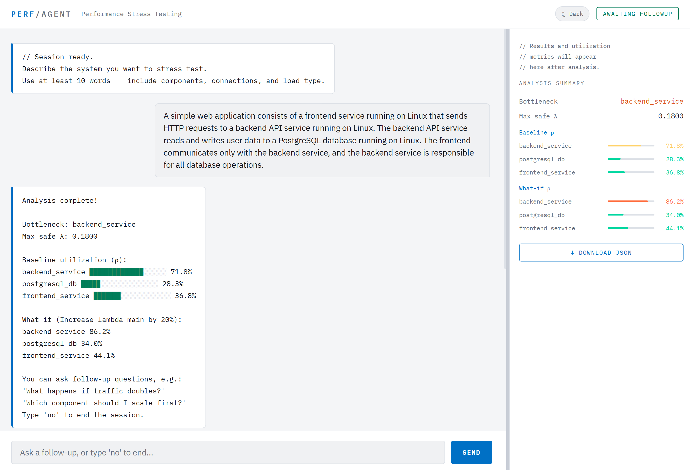

# nlip-stress-testing-agent

An AI-driven performance stress-testing platform built on the NLIP protocol.

The system allows user to describe their application in plain English, automatically generate workload simulations, and identify potential bottlenecks.



## Features

- Natural language to application description generation via Ollama
- Queue network modeling from application graphs
- Synthetic workload and latency simulation
- Bottleneck and what-if scenario analysis
- Web UI with NLIP support and follow-up Q&A

## Quick Start

### Prerequisites

- Python 3.10+
- Poetry (Python package manager)
- Ollama

### Installation

```bash
# Clone the repository
git clone https://github.com/JoshuaChelen/nlip-stress-testing-agent.git

# Clone submodules
git submodule update --init --recursive

# Install Python dependencies
poetry --directory nlip\nlip_web install
```

#### Set up Ollama

```bash
# Start ollama
ollama serve

# (Optional) Verify ollama is running
curl http://localhost:11434/api/tags

# Pull required base models
ollama pull granite3-moe
ollama pull llava

# Creating the project models
ollama create nlip-sys-desc -f model/NLIP-sys-desc.Modelfile
ollama create nlip-follow-up -f model/NLIP-follow-up.Modelfile
```

### Running the Application

Run from root:

#### Windows

```bash
.\run_web.bat
# Visit http://localhost:8030/
```

#### macOS

```bash
.\run_web.sh
# Visit http://localhost:8030/

```

## Project Structure

```
nlip-stress-testing-agent/
├── backend/                 # Core stress-testing engine (pipeline + logic)
│   ├── analyzer.py          # Bottleneck and performance analysis
│   ├── chat_cli.py          # CLI interface for interacting with system
│   ├── config.py            # Backend configuration settings
│   ├── data_conversion.py   # Converts graphs ↔ queue network formats
│   ├── data_generator.py    # Synthetic workload generation engine
│   ├── ollama_input.py      # Interface to Ollama models (natural language → system description)
│   ├── pipeline.py          # End-to-end execution pipeline
│   ├── user_input.py        # Input parsing
|
├── config/                  # Global configs
|
├── data/
│   ├── processed-data/     # Processed simulation outputs
│   ├── queueing-network/   # Queue network JSON representations
│   ├── results/            # Final analysis outputs
│   ├── schemas/            # JSON schema definitions
│   └── system-description/ # LLM-generated system JSON representations
|
├── debug/                 # Debug scripts (non-production)
|
├── model/                 # Ollama models
|
└── nlip/                  # NLIP framework integration layer
    ├── nlip_sdk/          # SDK for NLIP protocol
    ├── nlip_server/       # Backend NLIP server
    └── nlip_web/          # Web UI layer (NLIP-powered frontend)
        ├── nlip_web/
        |   |   stress_test_chat.py  # Main chat-based stress test UI
        │   └── ... (other nlip_web files)
        ├── static/                  # Frontend assets (JS/HTML/CSS)
        │   ├── stress_test.html
        |   ├── stress_test_script.js
        │   └── ... (other nlip_web files)
        ├── tests/
        └── website_modules/
```

## Architecture

The system consists of six main components:

1. UI: Simple interface that lets users describe their system in natural language and view the resulting queue model and analysis. Uses NLIP for all interaction.
2. System Description: A structured JSON model created from Ollama LLM translation of the user-described system
3. Queueing Network Description: A structured JSON model representing the application as queues and edges
4. Data Generator: Generates synthetic traffic data from a queue network description
5. Limit Predictor (Analyzer): Predict bottleneck queue and estimate the maximum workload the application can safely handle
6. Queue Load Estimates (Analyzer): Estimate the load on each queue by analyzing the generated traffic data (CSV)

### System Flow

Natural Language → System Description → Queue Network Description → Simulation (Data Generator) → CSV Data → Bottleneck Analysis → Results UI

## Limitations

- Synthetic data generator may occasionally produce negative or unrealistic delays under extreme workloads.
- Bottleneck predictions are heuristic-based and not validated against real production traces.

## Future Work Recommendation

## Resources

- [NLIP Documentation](https://nlip-project.org/#/)
- NLIP Repository
  - [NLIP Web](https://github.com/nlip-project/nlip_web)
  - [NLIP Server](https://github.com/nlip-project/nlip_server)
  - [NLIP SDK](https://github.com/nlip-project/nlip_sdk)
